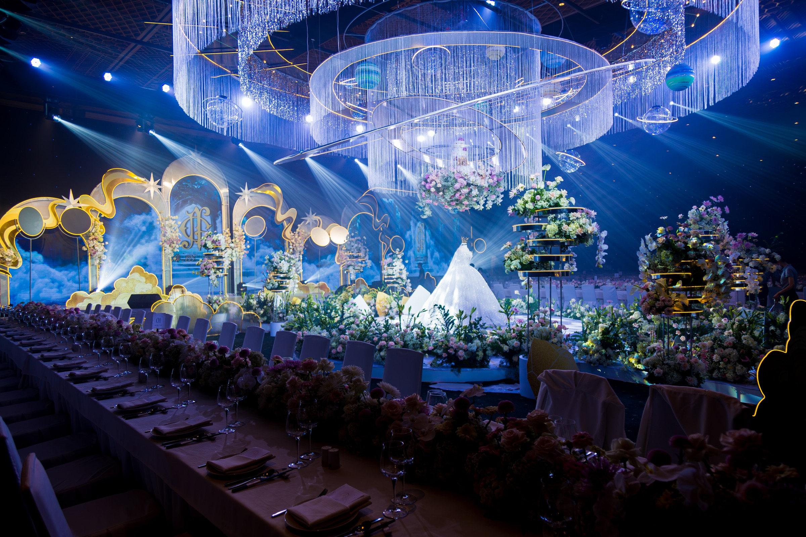
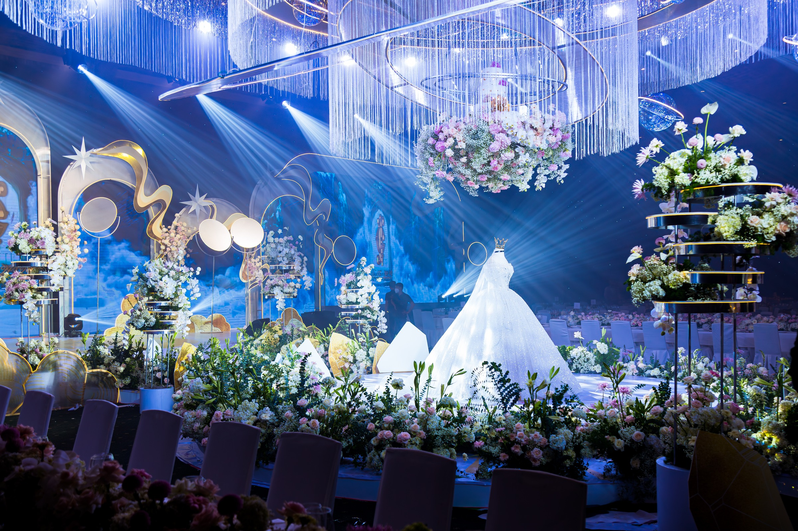

# CLAUDE.md

This file provides guidance to Claude Code (claude.ai/code) when working with code in this repository.

## What this project is

Single-file Vietnamese media portfolio for Võ Quang Minh (Soni) — a photographer and digital media strategist based in Đà Lạt. **The entire site lives in one file: `index.html`.** There is no build step, no framework, no package.json.

The `src/` and `public/` directories are scaffolding folders that exist but contain no code. All media assets are in `public/assets/`.

## Running locally

Open via a local HTTP server — **never open `index.html` directly as `file:///`**, browsers block video autoplay and CORS for local files.

```bash
# Quickest option (Node must be installed)
npx serve . --listen 5000
# then open http://localhost:5000
```

Asset paths in the HTML are written relative to the server root, e.g. `public/assets/lounge_1.mp4` resolves to `http://localhost:5000/public/assets/lounge_1.mp4`.

## Architecture of index.html

The file is structured top-to-bottom in this order:

1. **`<head>`** — Tailwind CDN, Google Fonts (`Cormorant Garamond`, `Playfair Display`, `Be Vietnam Pro`, `Inter`), Fontshare (`Amulya`, `Synonym`), Tailwind config, global `<style>` block.
2. **Floating island nav** — fixed pill navbar (`#hamBtn`, `#mMenu`).
3. **Sections in DOM order**: `#hero` → `#social` → `#work` → `#about` → `#skills` → `#contact` → `<footer>`.
4. **Modal overlays** — YouTube modal (`#yt-modal`) and video lightbox (`#vid-lightbox`) placed just before `</body>`.
5. **`<script>` blocks** (all IIFE, vanilla JS, no imports):
   - Gallery carousel (work section)
   - Social media lazy-load + hover/tap-to-play
   - YouTube modal
   - Film strip: active focus + brand nav + arrow buttons
   - Video lightbox
   - Hamburger menu toggle

## Key design tokens

Defined in the Tailwind config block and mirrored in CSS custom properties:

| Token                | Value                           |
| -------------------- | ------------------------------- |
| Background           | `#050505`                       |
| Accent (gold)        | `#D4AF37`                       |
| Body font            | `'Synonym', system-ui`          |
| Vietnamese body font | `'Be Vietnam Pro', system-ui`   |
| Serif hero font      | `'Cormorant Garamond', Georgia` |

**Vietnamese text rule:** Always use `font-family: 'Be Vietnam Pro', system-ui, sans-serif` with `letter-spacing: 0` for any text containing Vietnamese diacritics. `Synonym` does not have Vietnamese glyphs.

## Social Strategy section — Film Strip

The `#social` section contains a horizontal scroll-snap film strip (`#filmStrip`).

- **Cards**: `.sms-phone-wrap[data-brand="mo2|lounge|sun"]` — 300px wide desktop, 80vw mobile.
- **Active focus**: JS scroll listener → finds card closest to strip center → adds `.is-active` (scale 1.1, opacity 1); others get scale 0.9, opacity 0.4 via `.has-focus` parent class.
- **Brand nav tabs**: `.brand-nav-btn[data-brand="..."]` → smooth-scrolls strip to first card of that brand. Does **not** hide/show cards.
- **Edge arrows**: `#filmPrev` / `#filmNext` — absolute-positioned inside `.film-strip-wrap`, hidden on mobile.
- **Lazy loading**: Mơ 2 video uses `<source data-src="...">` swapped to `src` by IntersectionObserver. Golden Lounge uses direct `src` on `<video>` (no lazy load).
- **YouTube modal**: Cards with `data-yt-id` open `#yt-modal` with an embedded YouTube iframe. Close clears `iframe.src` to stop audio.
- **Video lightbox**: Clicking any `.film-strip .sms-phone-wrap` opens `#vid-lightbox` — full-screen 9:16 overlay, plays the card's video with sound. Close via X button, backdrop click, or Escape.

## Gallery section (#work)

JS-driven horizontal carousel. Cards are **full-screen** (`100vw × 100vh`). Navigation uses `goTo(idx)` with `translateX` — NOT native CSS scroll-snap. Currently 2 cards.

| Hằng số JS   | Giá trị hiện tại                  |
| ------------ | --------------------------------- |
| `N`          | `cards.length` (tự động)          |
| `PER_VENUE`  | `1`                               |
| `VENUES`     | `["White Palace", "Gem Center"]`  |
| `getCardW()` | `window.innerWidth` (full-screen) |

### CSS quy tắc kích thước card

```css
/* Base card — full-screen */
.gal-card {
  width: 100vw;
  height: 100%; /* 100% của section có height: 100vh */
}

/* Mobile override */
@media (max-width: 767px) {
  .gal-card {
    width: 100vw !important;
    height: 100vh !important;
  }
}

/* Cover card (có ảnh thực) */
.gal-card.wp-cover {
  width: 100vw;
  height: 100% !important;
  aspect-ratio: unset; /* KHÔNG dùng 3:2 nữa */
}
@media (max-width: 767px) {
  .gal-card.wp-cover {
    width: 100vw !important;
    height: 100vh !important;
    aspect-ratio: unset;
  }
}
```

### JS — goTo() với căn giữa

```js
function getCardW() {
  return window.innerWidth; /* full-screen = không cần offset */
}

function goTo(idx, animate) {
  idx = Math.max(0, Math.min(N - 1, idx));
  currentIdx = idx;
  track.style.transition =
    animate === false ? "none" : "transform 0.42s cubic-bezier(0.4,0,0.2,1)";
  var cardW = getCardW();
  var offset = Math.round(
    (window.innerWidth - cardW) / 2,
  ); /* = 0 khi full-screen */
  track.style.transform = "translateX(" + (offset - idx * cardW) + "px)";
  updateHUD(idx);
}
```

### Thêm card mới vào gallery

1. **HTML** — thêm `.gal-card.wp-cover` vào `#galleries-track`, tăng counter HUD (`/03`, `/04`…), thêm dot + fill tương ứng.
2. **JS** — thêm venue vào `VENUES[]`, thêm id dot/fill vào `dotGroups` và `fills`.
3. **Lightbox** — nếu card mới cần lightbox, dùng pattern `#gem-lb` (xem section "Thêm ảnh vào Lightbox Gallery").

## CSS conventions

- All component CSS lives in the `<style>` block in `<head>` — no external stylesheets.
- Tailwind utility classes are used alongside custom CSS classes; they coexist freely.
- Mobile overrides are in `@media (max-width: 767px)` blocks. Desktop-specific rules use `@media (min-width: 768px)`.
- Hairline borders throughout use `0.5px solid rgba(255,255,255,.07–.12)`.
- Section dividers use class `div-line` + `border-t`.

## Asset locations

```
assets/
  gallery/
    white-palace/       # White Palace cuisine photos
    golden-sun/         # Golden Sun Hotel photos
    gem-center/         # gem-1.jpg … gem-13.jpg — wedding concept
    mo2/
  about/
  projects/
```

Đường dẫn dùng `./assets/gallery/<venue>/<filename>` (tương đối, không có `/` đầu, không có `public/`).  
Tên file tiếng Việt phải URL-encode: `B%C3%A1nh%20socola...`

## Tối ưu assets trước khi thêm vào web (BẮT BUỘC)

**Quy tắc:** Luôn resize/compress ảnh và video trước khi thêm vào `index.html`. Ảnh gốc thường 10–30MB — phải giảm xuống dưới 700KB.

### Ảnh (JPG/PNG)

Tool: `sharp-cli` — đã cài global, entry point tại:

```
$(npm root -g)/sharp-cli/bin/cli.js
```

**Script chuẩn — resize cả folder:**

```bash
SHARP="$(npm root -g)/sharp-cli/bin/cli.js"
FOLDER="e:/Claude_Projects/soni-portfolio/assets/gallery/<tên-folder>"
TEMP="$FOLDER/tmp_out"
mkdir -p "$TEMP"

for f in "$FOLDER"/*.jpg; do
  name=$(basename "$f")
  node "$SHARP" -i "$f" -o "$TEMP" -q 82 resize 2000 2000 --withoutEnlargement --fit inside
  mv "$TEMP/$name" "$f"
  echo "$name: done"
done
rmdir "$TEMP"
```

| Tham số                | Giá trị        | Lý do                          |
| ---------------------- | -------------- | ------------------------------ |
| `-q 82`                | quality 82     | Cân bằng chất lượng/dung lượng |
| `resize 2000 2000`     | max 2000px     | Đủ cho full-screen retina      |
| `--withoutEnlargement` | không phóng to | Giữ nguyên ảnh nhỏ hơn 2000px  |
| `--fit inside`         | giữ tỉ lệ      | Không crop                     |

Kết quả điển hình: 20MB → 400–650KB (giảm ~40 lần).

**Nếu sharp-cli bị lỗi "command not found":** dùng `node "$SHARP"` thay vì gọi trực tiếp `sharp`.

### Video (MP4)

**ffmpeg đã được cài tại máy** (winget install Gyan.FFmpeg, version 8.1). Nếu lệnh `ffmpeg` không nhận trong bash, refresh PATH:

```powershell
$env:PATH = [System.Environment]::GetEnvironmentVariable("PATH","Machine") + ";" + [System.Environment]::GetEnvironmentVariable("PATH","User")
```

#### Kiểm tra thông số video gốc (BẮT BUỘC trước khi compress)

```bash
ffprobe -v quiet -print_format json -show_format -show_streams input.mp4
```

Các thông số cần chú ý: `duration`, `r_frame_rate`, `bit_rate`, `width × height`.

#### Công thức chuẩn cho video loop web (Social section, 9:16)

```bash
ffmpeg -i input.mp4 \
  -vcodec libx264 \
  -crf 28 \
  -preset slow \
  -r 30 \
  -vf "scale=1080:1920" \
  -acodec aac -b:a 96k \
  -movflags +faststart \
  -y output.mp4
```

| Tham số                | Giá trị | Lý do                                                                                            |
| ---------------------- | ------- | ------------------------------------------------------------------------------------------------ |
| `-crf 28`              | 28      | Tốt cho loop ambient (26=nét hơn, 30=nhỏ hơn)                                                    |
| `-r 30`                | 30fps   | Giảm từ 60fps — web không cần 60fps                                                              |
| `scale=1080:1920`      | 9:16    | Giữ đúng tỉ lệ điện thoại                                                                        |
| `-b:a 96k`             | 96 kbps | Đủ cho audio web (mặc định ~317k là quá dư)                                                      |
| `-movflags +faststart` | —       | **Quan trọng nhất** — di chuyển moov atom lên đầu file, trình duyệt play ngay không cần tải xong |
| `-preset slow`         | slow    | Nén tốt hơn dù lâu hơn                                                                           |

**Kết quả điển hình:** 9.3MB / 60fps → 4.4MB / 30fps (giảm ~53%).

#### Kiểm tra số giây (duration) nhanh

```bash
ffprobe -v quiet -show_entries format=duration -of default input.mp4
```

Output: `duration=21.083333` → video dài **21 giây**.  
Badge duration trên card sẽ hiển thị `0:21` tự động khi video load.

#### Công thức cho video ngang (landscape, gallery lightbox)

```bash
ffmpeg -i input.mp4 -vcodec libx264 -crf 26 -preset slow -r 30 -vf "scale=-2:1080" -acodec aac -b:a 96k -movflags +faststart -y output.mp4
```

`scale=-2:1080` = max 1080p, giữ tỉ lệ gốc (không crop).

#### Khi nào dùng CRF nào

| CRF | Dùng khi                           | File size tương đối |
| --- | ---------------------------------- | ------------------- |
| 23  | Ảnh chụp, video ảnh tĩnh đẹp       | lớn nhất            |
| 26  | Video gallery, lightbox            | trung bình          |
| 28  | Video loop background, social card | nhỏ nhất            |

## Thêm ảnh vào Lightbox Gallery (pattern Gem Center)

Lightbox gallery dùng pattern giống `#cuisine-lb` (White Palace). Mỗi venue cần:

### 1. CSS — thêm vào `<style>` trong `<head>`

```css
#gem-lb {
  position: fixed;
  inset: 0;
  z-index: 9999;
  background: rgba(0, 0, 0, 0.96);
  backdrop-filter: blur(22px);
  opacity: 0;
  pointer-events: none;
  transition: opacity 0.3s;
  overflow: hidden;
}
#gem-lb.is-open {
  opacity: 1;
  pointer-events: all;
}
/* close btn, scroll area, header — xem cuisine-lb làm template */

#gem-grid {
  display: grid;
  grid-template-columns: 1fr;
  gap: 0.75rem;
  max-width: 1100px;
  margin: 0 auto;
}
@media (min-width: 480px) {
  #gem-grid {
    grid-template-columns: repeat(2, 1fr);
  }
}
@media (min-width: 600px) {
  #gem-grid {
    grid-template-columns: repeat(3, 1fr);
  }
}
@media (min-width: 1024px) {
  #gem-grid {
    grid-template-columns: repeat(4, 1fr);
  }
}

/* Ảnh ngang span 2 cột từ 480px trở lên */
@media (min-width: 480px) {
  .gem-wide {
    grid-column: span 2;
  }
  .gem-wide .cuisine-img-wrap {
    aspect-ratio: 16 / 7;
  }
}
```

### 2. HTML — layout xen kẽ ngang + dọc

Thêm class `gem-wide` vào `.cuisine-item` để item đó span 2 cột (ảnh ngang `16:7`).  
Item không có class = 1 cột (ảnh dọc `3:4` — mặc định của `.cuisine-img-wrap`).

```html
<!-- Pattern: wide + dọc + dọc / dọc + dọc + wide / wide + dọc + dọc ... -->
<div id="gem-grid">
  <div class="cuisine-item gem-wide">
    <!-- ảnh ngang, span 2 cột -->
    <div class="cuisine-img-wrap">
      
    </div>
    <p class="cuisine-cap-name">Tên ảnh</p>
    <p class="cuisine-cap-desc">Mô tả ngắn</p>
  </div>
  <div class="cuisine-item">
    <!-- ảnh dọc, 1 cột -->
    <div class="cuisine-img-wrap">
      
    </div>
    <p class="cuisine-cap-name">Tên ảnh</p>
    <p class="cuisine-cap-desc">Mô tả ngắn</p>
  </div>
  <!-- ... -->
</div>
```

Nhịp chuẩn cho 4 cột desktop:

- Hàng 1: `gem-wide` (2 cột) + 2 × `cuisine-item` (1 cột mỗi) = 4 cột
- Hàng 2: 2 × `cuisine-item` + `gem-wide` (2 cột) = 4 cột
- Lặp xen kẽ

### 3. JS — thêm cạnh `openCuisineGallery()`

```js
function openGemLightbox() {
  var lb = document.getElementById("gem-lb");
  if (!lb) return;
  lb.classList.add("is-open");
  document.body.style.overflow = "hidden";
  lb.querySelector("#gem-lb-scroll").scrollTop = 0;
}
function closeGemLightbox() {
  var lb = document.getElementById("gem-lb");
  if (!lb) return;
  lb.classList.remove("is-open");
  document.body.style.overflow = "";
}
```

Thêm `closeGemLightbox()` vào Escape handler hiện có.

### 4. Gắn vào cover card

```html
<div
  class="gal-card wp-cover"
  data-venue="2"
  data-phase="0"
  onclick="openGemLightbox()"
></div>
```

## Chế độ tư vấn Web Expert (Socratic Method)

Khi người dùng đưa ra một ý tưởng hoặc câu hỏi về web, Claude đóng vai **chuyên gia Web Developer** và áp dụng phương pháp Socratic như sau:

1. **Vì sao điều này đúng?** — Giải thích nguyên lý kỹ thuật cốt lõi đằng sau ý tưởng.
2. **Nó vận hành ra sao?** — Mô tả cơ chế hoạt động cụ thể (trình duyệt, CSS engine, JS runtime, v.v.).
3. **Điều gì khiến nó không còn đúng?** — Chỉ ra edge cases, giới hạn, hoặc điều kiện làm phá vỡ giả thiết.
4. **Truy vấn tiếp** — Đặt thêm 1–2 câu hỏi phản biện để người dùng tự đào sâu hơn.
5. **Tóm tắt mức độ hiểu** — Kết thúc bằng đánh giá ngắn gọn: người dùng đang ở mức nào (surface / working / deep) và bước tiếp theo nên khám phá gì.

**Áp dụng khi:** người dùng hỏi "tại sao", "cái này hoạt động thế nào", hoặc đề xuất một kỹ thuật/ý tưởng web mới.

**Không áp dụng khi:** người dùng yêu cầu sửa code cụ thể — lúc đó thực hiện trực tiếp, không hỏi ngược.
